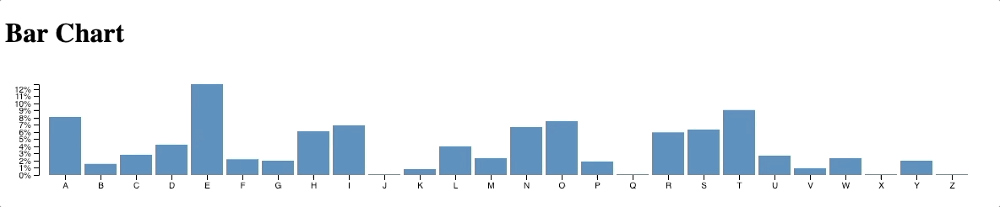

# Welcome

The goal of this project is to explore working with [Angular](https://angular.io) and [D3](https://d3js.org) for data visualization.

## Examples

### Responsive bar graph

The `responsive-bar-graph` example was based on the [tutorial](https://medium.com/@jeanphilippelemieux/creating-a-responsive-graph-with-angular-and-d3-b45bb8065588) available at [Creating a responsive graph with Angular and D3](https://medium.com/@jeanphilippelemieux/creating-a-responsive-graph-with-angular-and-d3-b45bb8065588)

### Nodes and links force directed graph

The `nodes-and-links-force-directed-graph` was based on the [tutorial](https://medium.com/netscape/visualizing-data-with-angular-and-d3-209dde784aeb) available at [Visualizing Data with Angular and D3](https://medium.com/netscape/visualizing-data-with-angular-and-d3-209dde784aeb)

